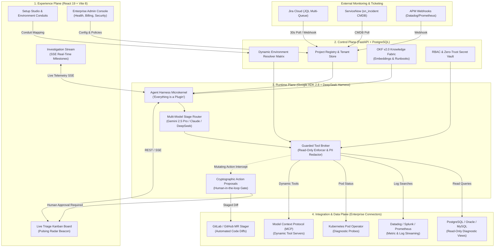
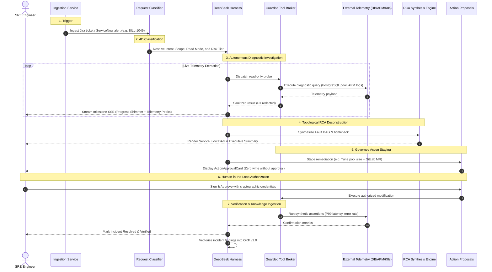

# Sentrix | Autonomous SRE & Multi-Tenant Incident Governance Platform

[](https://github.com/)
[](https://cloud.google.com/)
[](https://vitejs.dev/)
[](https://fastapi.tiangolo.com/)
[](LICENSE)

**Sentrix** is an enterprise-grade autonomous Site Reliability Engineering (SRE) and multi-tenant incident governance platform. It orchestrates real-time incident triage, root cause deconstruction, tool broker mediation, and cryptographic remediation proposal governance across distributed multi-cloud services.

---

## 🏗️ Architecture Overview

Sentrix operates across a **4-Plane Model** (Experience, Control, Runtime, and Integration/Data) designed to keep agent reasoning strictly advisory while enforcing human-in-the-loop authorization on all infrastructure mutations.



---

## 🔄 End-to-End Incident Lifecycle

When an incident hits production, Sentrix orchestrates the entire diagnostic and remediation process through seven deterministic stages:



---

## ⚡ Quick Start: How to Run the Platform

### System Requirements
- **Node.js**: `v18.0.0+` (`v20+` recommended)
- **Python**: `3.10` or `3.11`
- **Git**: Installed and configured
- **Database**: SQLite (default out-of-the-box) or PostgreSQL (production)

---

### Step 1: Clone Repository
```bash
git clone <repository-url>
cd Prism
```

---

### Step 2: Backend Setup & Launch
The backend is built with FastAPI, SQLite/PostgreSQL, Google ADK 2.8, and async SQLAlchemy.

```bash
cd backend

# Create and activate virtual environment
python3 -m venv venv
source venv/bin/activate       # On Windows: venv\Scripts\activate

# Install base dependencies (or tailored to your target cloud):
pip install -r requirements.txt            # Core Platform (Local / SQLite / Postgres)
# Or install based on target cloud:
# pip install -r requirements-azure.txt   # Microsoft Azure (Blob Storage, Key Vault, Identity)
# pip install -r requirements-gcp.txt     # Google Cloud Platform (GCS, Secret Manager, Trace)
# pip install -r requirements-aws.txt     # Amazon Web Services (S3, Secrets Manager via Boto3)
# pip install -r requirements-k8s.txt     # Kubernetes Cluster Pod Operator
# pip install -r requirements-all.txt     # All clouds combined

# Or from project root with npm:
# npm run setup:azure  /  npm run setup:gcp  /  npm run setup:aws  /  npm run setup:all

# (Optional) Initialize schema and seed RBAC roles
python -m database.schema
python -m database.seed_data --apply

# Run FastAPI ASGI server with auto-reload
python main.py
# Or directly via Uvicorn:
# uvicorn server:app --host 0.0.0.0 --port 8000 --reload
```

> **Backend Health Verification:**  
> Verify backend health at: `http://localhost:8000/health` or open Swagger UI at `http://localhost:8000/docs`.

---

### Step 3: Frontend Setup & Launch
The frontend is powered by React 19, Vite 8, and a bespoke high-contrast telemetry design system.

```bash
# Open a new terminal window
cd frontend

# Install dependencies
npm install

# Start Vite development server
npm run dev
```

> **Access Application:**  
> Open your browser at **`http://localhost:5173`** (Default entry point routes to Live Triage Board or Admin Console).

---

## 🧭 Navigation Directory & Routes

| Route | Module | Purpose |
|---|---|---|
| `/p/:projectKey/board` | **Live Triage Board** *(#1 Priority)* | Real-time Kanban board with pulsating radar beacon, priority filters, team comments, and evidence lockers. |
| `/p/:projectKey/triage` | **Auto-Triage Hub** | Live Jira/ServiceNow polling, triage feed, service flow visualizer, root cause analysis, GitLab diff approvals. |
| `/p/:projectKey/investigations` | **Investigation Stream** | Interactive multi-stage thinking progress card with live telemetry peeks, steering chips, and approval cards. |
| `/p/:projectKey/overview` | **Project Command Center** | Real-time SLA compliance, MTTA/MTTR metrics, active incidents, and telemetry feeds. |
| `/p/:projectKey/metrics` | **SRE Reliability & Metrics** | Interactive dual-curve SVG area chart (MTTA/MTTR), SLO error budget gauge, daily velocity histogram & squad matrix. |
| `/p/:projectKey/setup` | **Setup & Studio** | Multi-queue JQL generator, datasource connectors forum, dynamic environment flow, runbook uploader. |
| `/p/:projectKey/environments` | **Environment Resolver** | Interactive conduit mapping connecting project environments to tool instances without hardcoding. |
| `/p/:projectKey/reports` | **Autonomous SRE Reports** | 4-cycle historical improvement curves, triage stats, agent metrics, and SendGrid executive email brief dispatcher. |
| `/p/:projectKey/feedback` | **Domain Feedback Loop** | Engineer validation, accuracy scoring, and reinforcement learning signals for ADK agents. |
| `/admin/overview` | **Enterprise Admin Console** | Platform health, multi-project usage, connectors catalog & security policies. |
| `/admin/projects` | **Projects Fleet** | Register new enterprise projects, configure tiers, and manage project lifecycles. |
| `/admin/organizations` | **Organizations** | Multi-tenant organizational management and policy inheritance. |
| `/admin/connectors` | **Connectors Catalog** | Manage connections to PostgreSQL, Oracle, Datadog, Splunk, Kubernetes, and Jira. |
| `/admin/system-health` | **System Health & Observability** | CPU, memory, socket connections, latency distributions, and connector ping status. |
| `/admin/billing` | **FinOps & Model Usage** | Per-project token attribution, cost tracking, and model rate limit monitoring. |
| `/admin/security-policy` | **Security & Audit Logs** | Immutable audit ledger of every prompt, tool query, approval, and administrative change. |
| `/docs` | **Platform Knowledge Base** | In-app operational tour, architecture breakdown, prompt recipes, and live schema tester. |

---

## 🔐 Core Invariants & Security Guardrails

Sentrix enforces five non-negotiable architectural invariants:

1. **Reasoning is NOT Authorization:**  
   LLMs generate diagnoses and proposals, but have **zero autonomous write capabilities**. Mutating actions require explicit human sign-off via cryptographic action proposals.
2. **Read-Only Auto-Triage:**  
   All automatic probes dispatched by the Tool Broker are strictly verified read-only queries (`SELECT`, `kubectl get`, `datadog query`, `splunk search`). AST parsing blocks write statements.
3. **Decoupled Environment-to-Tool Conduits:**  
   No hardcoded URLs. Projects define dynamic environment lists (e.g. `["us-east-prod", "eu-dr", "stage-alpha"]`), and the Resolver maps them to concrete tool instances.
4. **Zero-Trust Token Vault & PII Redaction:**  
   External credentials (passwords, tokens, SSH keys) remain encrypted in the backend. Sensitive customer patterns (JWTs, PANs, emails) are stripped before sending telemetry to models.
5. **Deterministic Auditability:**  
   Every investigation run produces an immutable audit record containing model snapshots, token consumption, raw tool commands, approval signatures, and git commit hashes.

---

## 📚 Documentation Index

[`docs/README.md`](./docs/README.md) is the canonical documentation map. Use the focused guides below for the relevant audience:

- [Platform Architecture & Operational Specification (`docs/HOW_THE_PROJECT_WORKS.md`)](./docs/HOW_THE_PROJECT_WORKS.md) — Canonical guide to the 4-plane model, incident lifecycle, and subsystem mechanics.
- [Production Architecture & Data Model (`docs/production-architecture.md`)](./docs/production-architecture.md) — Multi-tenant hierarchy, persistence lifecycle, ADK runtime, and deployment topologies.
- [Skills & 4D Request Classification Architecture (`docs/SENTRIX_SKILLS_AND_REQUEST_CLASSIFICATION_ARCHITECTURE.md`)](./docs/SENTRIX_SKILLS_AND_REQUEST_CLASSIFICATION_ARCHITECTURE.md) — 4-layer skill hierarchy (L0–L3) and 4-dimensional classification matrix.
- [DeepSeek Harness & Plugin Architecture (`docs/harness-plugins.md`)](./docs/harness-plugins.md) — Microkernel plugin lifecycle and configuration inheritance.
- [Application Source & Local Data Policy (`docs/local-data-policy.md`)](./docs/local-data-policy.md) — Local data retention, storage guidelines, and git hygiene.
- [Backend Architecture & API Guide (`backend/README.md`)](./backend/README.md) — Backend developer manual, directory breakdown, and REST/SSE endpoints.
- [Frontend Architecture & Design Guide (`frontend/README.md`)](./frontend/README.md) — React 19 UI architecture, telemetry design system, and component catalog.
- [Skills Catalog & Organization (`skills/README.md`)](./skills/README.md) — Guide to platform diagnostic skills and developer assistance skills.

---

## 🧪 Testing & Build Verification

```bash
# Frontend production build & lint
cd frontend
npm run lint
npm run build

# Backend automated test suite
cd ../backend
python -m unittest discover tests/
# Or if pytest is installed: pytest tests/
```

---

*Sentrix — Autonomous Site Reliability Engineering with Uncompromising Governance.*
