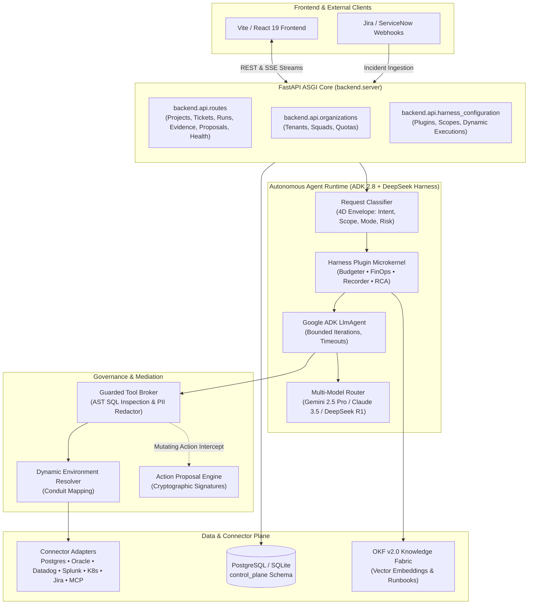

# Sentrix Backend Service | Autonomous SRE Engine & Control Plane

[](https://fastapi.tiangolo.com/)
[](https://cloud.google.com/)
[](https://www.postgresql.org/)

The **Sentrix Backend** is a high-concurrency, asynchronous Python service built on **FastAPI**, **Google ADK 2.8**, and **async SQLAlchemy 2.0**. It powers the Sentrix Control Plane and Runtime Plane, orchestrating real-time incident polling, 4-dimensional request classification, autonomous diagnostic telemetry extraction, topological root cause analysis, and cryptographically governed remediation proposals.

---

## 🏗️ Backend Architectural Topology



---

## 📁 Directory Structure Breakdown

```
backend/
├── main.py                     # Entrypoint wrapper ensuring sys.path resolution
├── server.py                   # FastAPI application, CORS middleware & lifespan
├── requirements.txt            # Python dependencies (FastAPI, ADK, SQLAlchemy, etc.)
│
├── api/                        # REST & SSE API Controllers
│   ├── routes.py               # Core operational APIs (runs, triage, tools, approvals)
│   ├── organizations.py        # Multi-tenant organization and squad APIs
│   └── harness_configuration.py# Dynamic plugin registry and scoped executor APIs
│
├── agent/                      # Core Intelligence & Orchestration Engines
│   ├── request_classifier.py   # 4-Dimensional Chat Request Classifier
│   ├── triage_engine.py        # Automated Jira/ServiceNow ingestion & triage worker
│   ├── skills_engine.py        # 4-Layer Skill resolver and prompt compiler
│   ├── tool_broker.py          # Read-only enforcement, AST verification, and execution gate
│   ├── environment_resolver.py # Dynamic mapping between project envs and connector instances
│   ├── governed_executor.py    # Staged action proposal generator and execution coordinator
│   ├── model_router.py         # Multi-model selection (Gemini, Claude, GPT, DeepSeek)
│   ├── parameter_resolver.py   # Entity extractor (BAN, Order ID, cluster names)
│   └── scheduler.py            # Background polling workers for Jira/ServiceNow
│
├── harness/                    # DeepSeek Agent Harness ("Everything is a Plugin")
│   ├── plugin_base.py          # Abstract lifecycle hook interface (on_session_start, etc.)
│   ├── plugin_registry.py      # Microkernel plugin discovery and priority management
│   ├── context_budgeter.py     # Token window budget enforcement and payload truncation
│   ├── finops_tracker.py       # Inference cost tracking and project spend quotas
│   ├── session_recorder.py     # Immutable session recording and replay traces
│   ├── rca_engine.py           # Topological Fault DAG builder and causality inference
│   └── connector_runtime.py    # Per-call credentialed connector dispatcher
│
├── connectors/                 # Enterprise Integration Adapters
│   ├── base.py                 # Abstract BaseConnector interface
│   ├── registry.py             # Global connector registry and health verification
│   ├── db_connector.py         # PostgreSQL / Oracle / MySQL read-only query adapter
│   ├── datadog_connector.py    # Datadog APM metrics and traces reader
│   ├── splunk_connector.py     # Splunk and Unix log search adapter
│   ├── jira_connector.py       # Jira Cloud issue query and comment adapter
│   ├── servicenow_connector.py # ServiceNow incident table reader
│   ├── gitlab_connector.py     # GitLab merge request stager and diff builder
│   └── mcp_discovery.py        # Model Context Protocol client (stdio & SSE transports)
│
├── database/                   # Persistence Layer
│   ├── connection.py           # Async SQLAlchemy engine and session factories
│   ├── models.py               # Complete relational ORM models (control_plane schema)
│   ├── schema.py               # DDL generator and non-destructive table initializer
│   ├── schema.sql              # Clean, immutable SQL schema definition
│   └── seed_data.py            # Explicit system RBAC role definitions seeder
│
├── okf/                        # Organizational Knowledge Fabric
│   └── fabric.py               # Semantic vector index and past postmortem correlation
│
├── metrics/                    # SRE Reliability Calculations
│   └── calculator.py           # MTTA, MTTR, SLO error budgets, and velocity calculations
│
├── mock_servers/               # Mock Enterprise Servers (for offline testing)
│   ├── mock_jira.py            # Emulated Jira REST API
│   └── mock_oracle.py          # Emulated Oracle billing database
│
└── tests/                      # Automated Test Suite
    ├── unit/                   # Unit tests for classifier, broker, and models
    ├── integration/            # API endpoint and SSE streaming tests
    └── eval/                   # Agent quality and benchmark datasets
```

---

## ⚡ Quick Start: Developer Initiation

### 1. Prerequisites
- Python `3.10` or `3.11`
- SQLite (included with Python) or PostgreSQL 15+

### 2. Environment Setup
```bash
cd backend

# Create virtual environment
python3 -m venv venv
source venv/bin/activate       # On Windows: venv\Scripts\activate

# Option A: Install base platform dependencies (Local / SQLite / Postgres)
pip install -r requirements.txt

# Option B: Install tailored to your enterprise cloud target
pip install -r requirements-azure.txt   # Microsoft Azure (Blob Storage, Key Vault, Identity)
pip install -r requirements-gcp.txt     # Google Cloud Platform (GCS, Secret Manager, Trace)
pip install -r requirements-aws.txt     # Amazon Web Services (S3, Secrets Manager via Boto3)
pip install -r requirements-k8s.txt     # Kubernetes Cluster Pod Operator
pip install -r requirements-all.txt     # All clouds combined

# Or run the interactive cloud installer from repository root:
# python3 scripts/install_cloud_deps.py --cloud azure  (or npm run setup:azure)
```

### 3. Configure Environment Variables
Create or edit `.env` in `backend/`:
```env
# Database configuration (defaults to local SQLite if omitted)
DATABASE_URL=sqlite+aiosqlite:///./sentrix.db

# Optional: Model API Keys
GEMINI_API_KEY=your_gemini_api_key
ANTHROPIC_API_KEY=your_claude_api_key
OPENAI_API_KEY=your_openai_api_key
DEEPSEEK_API_KEY=your_deepseek_api_key

# Logging
LOG_LEVEL=INFO
```

### 4. Initialize Database Schema
```bash
# Verify schema and create missing tables non-destructively
python -m database.schema

# Apply system RBAC roles (Admin, SRE Lead, Engineer, Auditor)
python -m database.seed_data --apply
```

### 5. Launch Backend Server
```bash
# Run server using entrypoint
python main.py

# Or launch directly with uvicorn:
uvicorn server:app --host 0.0.0.0 --port 8000 --reload
```

Backend endpoints will be accessible at:
- **Health Check:** `http://localhost:8000/health`
- **Interactive Swagger UI:** `http://localhost:8000/docs`
- **ReDoc:** `http://localhost:8000/redoc`

---

## 📡 REST & SSE Endpoint Reference

### Health & System Status
| Method | Endpoint | Description |
|---|---|---|
| `GET` | `/health` | System health check (PostgreSQL/SQLite status, ADK version). |
| `GET` | `/api/health` | Extended telemetry health report for admin monitoring. |

### Incidents & Live Triage
| Method | Endpoint | Description |
|---|---|---|
| `GET` | `/api/projects/{project_key}/tickets` | List ingested tickets with priority, SLA, and triage status. |
| `POST` | `/api/projects/{project_key}/tickets` | Ingest a new incident ticket manually or via webhook. |
| `POST` | `/api/projects/{project_key}/triage/poll` | Trigger background polling cycle for Jira and ServiceNow queues. |

### Investigation Runs & Live Streaming
| Method | Endpoint | Description |
|---|---|---|
| `POST` | `/api/projects/{project_key}/runs` | Initiate an autonomous investigation run for a ticket. |
| `GET` | `/api/runs/{run_id}` | Fetch current status, milestones, and metadata for a run. |
| `GET` | `/api/runs/{run_id}/stream` | **Server-Sent Events (SSE)** real-time stream of thinking milestones and telemetry peeks. |
| `GET` | `/api/runs/{run_id}/evidence` | Retrieve raw evidence collected across tools for this run. |
| `GET` | `/api/runs/{run_id}/rca` | Retrieve synthesized Root Cause Analysis report and Fault DAG. |

### Governed Action Proposals & Approvals
| Method | Endpoint | Description |
|---|---|---|
| `GET` | `/api/projects/{project_key}/proposals` | List pending and executed cryptographic action proposals. |
| `POST` | `/api/proposals/{proposal_id}/approve` | Authenticated human sign-off; binds user signature and executes action. |
| `POST` | `/api/proposals/{proposal_id}/reject` | Reject proposal with recorded explanation. |

### Environment Resolver & Conduits
| Method | Endpoint | Description |
|---|---|---|
| `GET` | `/api/projects/{project_key}/environments` | List dynamic environments and resolved connector conduits. |
| `POST` | `/api/projects/{project_key}/environments/mappings` | Save conduit mapping linking project environment to connector instance. |
| `POST` | `/api/connectors/{connector_id}/test` | Perform 1-click live latency and socket reachability ping. |

### Enterprise Admin & Organizations
| Method | Endpoint | Description |
|---|---|---|
| `GET` | `/api/admin/organizations` | List all organizations, teams, and allocated quotas. |
| `GET` | `/api/admin/audit-logs` | Retrieve immutable audit ledger of all user and agent actions. |
| `GET` | `/api/admin/billing/usage` | Token usage, cost attribution, and model breakdown. |

---

## 🧪 Testing & Quality Assurance

```bash
# Run tests using built-in unittest
python -m unittest discover tests/

# Or with pytest (if installed)
pytest tests/
```

---

*Sentrix Backend Architecture — Resilient, Observable, and Cryptographically Governed.*
