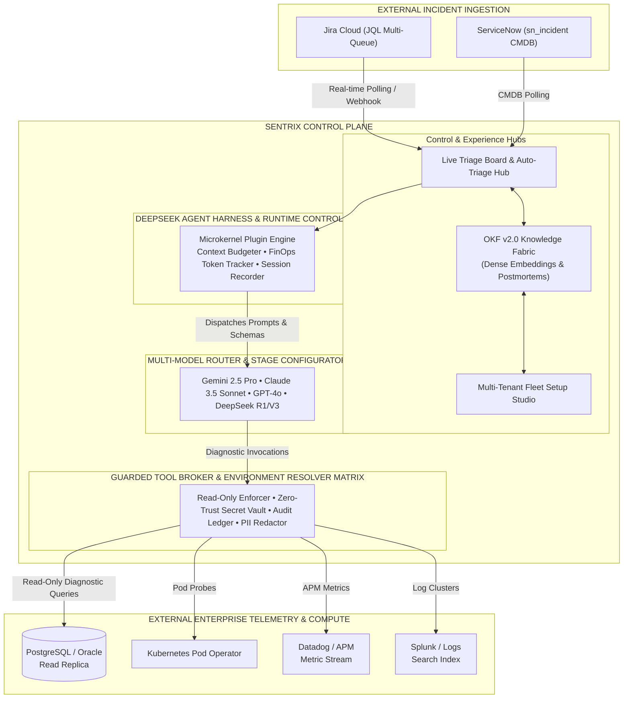
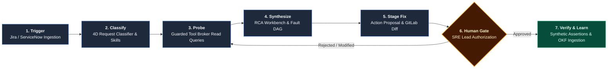
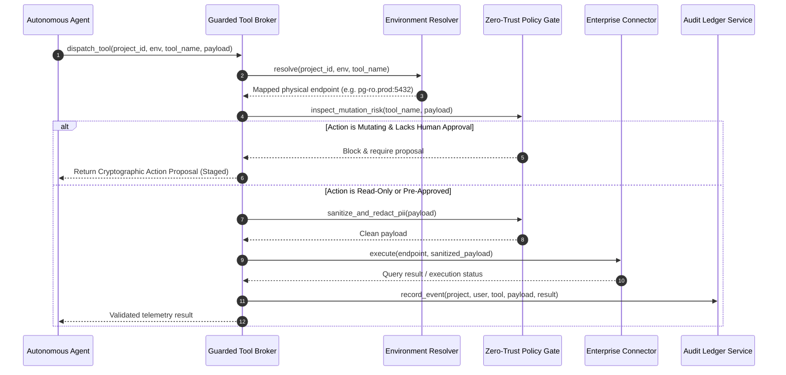

# Sentrix / PRISM | Platform Architecture & Operational Specification
## How the Autonomous SRE & Incident Governance Platform Works

**Document Version:** 2.0  
**Target Audience:** SRE Engineers, Software Architects, Platform Administrators, Security & Governance Teams  
**System Status:** Production Enterprise Specification

---

## Table of Contents
1. [Executive Summary & Core Mission](#1-executive-summary--core-mission)
2. [The 4-Plane Architectural Model](#2-the-4-plane-architectural-model)
3. [Core Architectural Invariants](#3-core-architectural-invariants)
4. [End-to-End Incident Lifecycle Walkthrough](#4-end-to-end-incident-lifecycle-walkthrough)
5. [Deep-Dive Subsystem Mechanics](#5-deep-dive-subsystem-mechanics)
   - [5.1 DeepSeek Harness & Plugin Architecture](#51-deepseek-harness--plugin-architecture)
   - [5.2 Guarded Tool Broker & Security Engine](#52-guarded-tool-broker--security-engine)
   - [5.3 Dynamic Environment-to-Tool Resolver Matrix](#53-dynamic-environment-to-tool-resolver-matrix)
   - [5.4 Multi-Model Intelligent Routing & FinOps Tracker](#54-multi-model-intelligent-routing--finops-tracker)
   - [5.5 OKF v2.0 (Organizational Knowledge Fabric)](#55-okf-v20-organizational-knowledge-fabric)
   - [5.6 Enterprise Connectors & Model Context Protocol (MCP)](#56-enterprise-connectors--model-context-protocol-mcp)
6. [User Interface & Mission Control Experience](#6-user-interface--mission-control-experience)
7. [Enterprise Governance, RBAC & Multi-Tenancy](#7-enterprise-governance-rbac--multi-tenancy)
8. [Day-to-Day Operational Runbook](#8-day-to-day-operational-runbook)

---

## 1. Executive Summary & Core Mission

**Sentrix** (operating under the **PRISM** framework — *Platform for Reliable Investigation, Synthesis, and Mediation*) is an enterprise-grade autonomous Site Reliability Engineering (SRE) and multi-tenant incident governance platform.

### The Problem It Solves
In modern enterprise environments, diagnosing production outages is hindered by:
- **Alert Fatigue & Fragmented Telemetry:** Incidents trigger dozens of alerts scattered across APM (Datadog), log aggregators (Splunk), container orchestrators (Kubernetes), and relational databases (PostgreSQL/Oracle).
- **Manual Diagnostic Latency:** Mean Time to Acknowledge (MTTA) averages 30–45 minutes while engineers manually gather metrics, thread logs, and inspect database locks.
- **Uncontrolled or Unsafe Automation:** Traditional automation scripts either lack deep context or operate with excessive write permissions, posing catastrophic risks to production stability.

### The Sentrix Solution
Sentrix provides **governed autonomous operations**:
1. **Autonomous Read-Only Diagnostics:** When an incident arrives (via Jira, ServiceNow, or APM webhooks), Sentrix dispatches autonomous diagnostic agents that query logs, check connection pools, review slow queries, inspect pod crashes, and retrieve past runbooks in **seconds**.
2. **Deterministic Root Cause Analysis (RCA):** Synthesizes telemetry across all microservices into a topological Fault Directed Acyclic Graph (DAG), isolating the exact failing component and its upstream dependencies.
3. **Cryptographically Governed Remediation Proposals:** The platform **never allows an AI model to execute write actions autonomously**. Every proposed remediation (pod restarts, connection pool tuning, schema indexes, rollback MRs) is staged as an immutable **Cryptographic Action Proposal** requiring human-in-the-loop domain engineer authorization.



---

## 2. The 4-Plane Architectural Model

Sentrix is partitioned into four decoupled planes to ensure resilience, multi-tenant data isolation, and strict security boundaries:

| Plane | Core Responsibility | Key Components |
|---|---|---|
| **1. Experience Plane** | Human interaction, live streaming observation, visual DAG exploration, and cryptographic approval controls. | • Live Triage Kanban Board with live radar beacon<br>• Auto-Triage Hub & RCA Workbench<br>• Investigation Stream (SSE streaming with progress chips)<br>• Project Setup Studio & Interactive Environment Conduits<br>• Enterprise Admin Console (Health, Security, Billing) |
| **2. Control Plane** | Multi-tenant hierarchy, configuration inheritance, security policies, token management, and audit logging. | • Project Registry & Configuration Store<br>• Dynamic Environment Resolver<br>• Zero-Trust RBAC & Encrypted Secret Vault<br>• OKF v2.0 Vector Knowledge Fabric<br>• Security Service (Audit trail, Rate limits, PII redact) |
| **3. Runtime Plane** | Agent orchestration, state machines, context budget management, and execution monitoring. | • DeepSeek Plugin Harness ("Everything is a Plugin")<br>• Multi-Model Intelligent Stage Router<br>• Context Budgeter & FinOps Cost Tracker<br>• Governed Action Proposal State Machine<br>• Session & Diagnostic Recorder |
| **4. Integration & Data Plane** | Secure connectors to external enterprise tools, telemetry databases, and execution platforms. | • Read-Only Diagnostic Probes (Postgres, Oracle, Unix)<br>• Observability Connectors (Datadog, Splunk, Prometheus)<br>• Cloud Orchestration (Kubernetes, AWS/GCP APIs)<br>• Collaboration & Tickets (Jira, ServiceNow, GitLab, Slack)<br>• Model Context Protocol (MCP) Client Matrix |

---

## 3. Core Architectural Invariants

Every design decision in Sentrix is governed by five non-negotiable principles:

1. **Reasoning is NOT Authorization:**  
   The Large Language Model is an advisory intelligence, not an execution engine. It can suggest diagnostic queries and synthesize findings, but it has zero write capabilities. Modifying actions must be formalized into structured proposals and approved by an authorized domain engineer.
2. **Zero-Hardcoded Environments:**  
   The system never imposes arbitrary environment names like `["dev", "staging", "prod"]`. Every enterprise project defines its own dynamic environment array (e.g., `["apac-prod", "us-east-dr", "blue-stage", "payment-pci"]`).
3. **Decoupled Dynamic Environment-to-Tool Conduits:**  
   Tools and datastores maintain independent connection endpoints. Sentrix connects project environments to tool instances through an interactive mapping resolver (`ProjectToolEnvMapping`), preventing hardcoded URLs.
4. **Bifurcated Tool Broker Guardrails:**  
   - **Read-Only Telemetry:** Automated, zero-friction execution for diagnostic queries (`SELECT`, `kubectl get`, `datadog query`, `splunk search`).
   - **Governed Action Proposals:** Any mutating action (`UPDATE`, `kubectl delete/restart`, `ALTER SYSTEM`, `merge MR`) generates a signed cryptographic proposal that halts the pipeline until human sign-off.
5. **Deterministic Auditability & Reproducibility:**  
   Every investigation run produces an immutable audit record containing: the model snapshot, token consumption, exact tool commands executed, returned payloads, human approval signatures, and git commit hashes.

---

## 4. End-to-End Incident Lifecycle Walkthrough


### Stage 1: Ingestion & Polling
- **Multi-Queue Jira JQL / ServiceNow Monitoring:**  
  The background ingestion scheduler polls configured JQL filters every 30 seconds (e.g., `project = "BILLING" AND queue in ("SRE-QUEUE") AND status in ("Open")`). Concurrently, ServiceNow incident tables (`sn_incident`) are scanned based on CMDB configuration items.
- **Incident Ingestion:** New tickets (e.g., `BILL-1049: HikariCP Connection Pool Starvation`) are registered in the project database and placed in the **Incoming Triage** queue on the Live Triage Board.

### Stage 2: Signal Ingestion & Request Classification
- The **Request Classifier** inspects the incoming ticket title, error stack trace, affected microservice, and severity tier.
- The classifier activates matching **Skills** (e.g., `postgres_lock_diagnostic`, `kubernetes_pod_triage`, `service_mesh_latency_analysis`) and configures the execution pipeline.

### Stage 3: Autonomous Diagnostic Investigation (Live Stream)
- The **DeepSeek Harness** initiates an autonomous investigation session.
- Diagnostic milestones are reported in real time via Server-Sent Events (SSE) to the frontend:
  1. *Milestone 1:* Tool Broker Dispatch.
  2. *Milestone 2:* Telemetry Extraction (executing parallel read-only queries against PostgreSQL replica, Datadog APM, and Kubernetes metrics).
  3. *Milestone 3:* Historical Correlation against OKF v2.0 past incident embeddings.
  4. *Milestone 4:* RCA Synthesis.
- Engineers watching the Live Investigation Stream can interact with **Telemetry Peeks** (inspect raw SQL output, pod restart counts) or click **Steering Guidance Chips** (e.g., `[Focus Connection Pool]`) to guide agent reasoning mid-flight.

### Stage 4: Topological RCA Deconstruction
- The **RCA Engine** organizes diagnostic evidence into a structured causality chain:
  - **Primary Root Cause:** HikariCP connection pool exhausted (max 20/20 held by unindexed long-running billing queries).
  - **Secondary Contributing Factors:** Upstream traffic spike (+180% surge) caused queuing at Envoy proxy; timeout threshold was 30,000ms.
- A visual **Service Flow DAG** (`Client -> API Gateway -> Billing Service [BLOCKED] -> PostgreSQL [STALLED]`) is generated with the bottleneck highlighted in red.

### Stage 5: Remediation Staging & Cryptographic Action Proposal
- Instead of attempting to execute changes directly, the agent generates a two-pronged solution:
  1. **Infrastructure Remediation:** An Action Proposal to dynamically tune HikariCP maximum pool size from 20 to 50 and restart worker deployment `billing-processor`.
  2. **Application Code Fix:** A GitLab Merge Request is prepared on branch `fix/BILL-1049-hikari-pool` with a syntax-highlighted side-by-side code diff updating the application configuration and adding the missing index.

### Stage 6: Human-in-the-Loop Domain Engineer Authorization
- The staged action appears on the engineer's triage dashboard and in the investigation stream as an `<ActionApprovalCard>`.
- The on-call SRE reviews:
  - Estimated impact and safety score (e.g., `Risk: Low`, `Estimated Downtime: 0s`).
  - Required IAM role (`SRE_LEAD` or `ADMIN`).
  - Automated rollback playbook.
- When the engineer clicks **Approve & Execute**, their authenticated user identity (`user_id`, timestamp, cryptographic signature) binds to the execution payload.

### Stage 7: Post-Incident Verification, SLO Update & OKF Ingestion
- The Tool Broker executes the approved action through the target connector (e.g., updates deployment, triggers merge).
- The agent runs synthetic verification assertions:
  - Connection pool utilization dropped to 28%.
  - P99 latency recovered from 31,400ms to 84ms.
  - HTTP 504 error rate dropped to 0.00%.
- The incident status transitions to **Resolved & Verified** on the Kanban board.
- The complete incident resolution, symptoms, RCA findings, and fix scripts are automatically vectorized and indexed into **OKF v2.0** so future similar outages are diagnosed instantaneously.

---

## 5. Deep-Dive Subsystem Mechanics

### 5.1 DeepSeek Harness & Plugin Architecture
The agent runtime follows a strict **"Everything is a Plugin"** philosophy inspired by high-performance agent harnesses:
- **`PluginBase` & `PluginRegistry`:** Every capability (RCA engine, session recorder, FinOps tracker, context budgeter, memory manager) is implemented as an isolated plugin inheriting standardized lifecycle hooks:
  - `on_session_start(context)`
  - `pre_tool_execute(tool_name, params)`
  - `post_tool_execute(tool_name, result)`
  - `on_model_response(response, usage)`
  - `on_session_end(summary)`
- **Context Budgeter:** Prevents token exhaustion and hallucinations by tracking prompt and telemetry token footprints, intelligently truncating oversized log outputs before LLM ingestion.
- **FinOps Tracker:** Quantifies inference expenditures per project, team, and model tier in real time, alerting when usage approaches project budget ceilings.

### 5.2 Guarded Tool Broker & Security Engine
The Tool Broker is the single gatekeeper between AI reasoning and real infrastructure:
```python
# Conceptual Tool Broker Verification Pipeline
async def dispatch_tool(project_id: str, environment: str, tool_name: str, payload: dict, user_ctx: UserContext):
    # 1. Project & Environment Boundary Resolution
    endpoint = await EnvironmentResolver.resolve(project_id, environment, tool_name)
    
    # 2. Inspect Query Mutation Risk
    if ToolRegistry.is_mutating_action(tool_name, payload):
        if not user_ctx.has_approved_proposal(payload):
            # Block and generate cryptographic proposal
            return await ActionProposalService.create_proposal(project_id, tool_name, payload)
            
    # 3. Apply Zero-Trust Security Filters (PII Redaction & Guardrails)
    sanitized_payload = SecurityService.sanitize(payload)
    
    # 4. Execute via Target Connector
    result = await ConnectorRegistry.execute(endpoint, sanitized_payload)
    
    # 5. Log Immutably to Audit Ledger
    AuditService.log(project_id, user_ctx, tool_name, sanitized_payload, result)
    return result
```



### 5.3 Dynamic Environment-to-Tool Resolver Matrix
Unlike legacy platforms that hardcode database strings and cluster contexts, Sentrix decouples them completely:
- **Project Scope:** Project `BILLING` defines environments `["prod-primary", "prod-eu-west", "staging-alpha"]`.
- **Connector Catalog:** Enterprise connectors exist as independent entities (`postgres-cluster-primary`, `k8s-prod-us-east`, `datadog-global`).
- **Dynamic Mapping Table (`ProjectToolEnvMapping`):**
  - Project `BILLING` + Env `prod-primary` ──► Connector `postgres-cluster-primary` (Host: `pg-ro.prod.corp:5432`, DB: `billing_core`).
  - Project `BILLING` + Env `prod-eu-west` ──► Connector `postgres-cluster-eu` (Host: `pg-ro.eu.corp:5432`, DB: `billing_eu`).
- The agent requests a diagnostic query against `"billing_database"` under the active environment, and the Resolver transparently binds the query to the correct physical endpoint.

### 5.4 Multi-Model Intelligent Routing & FinOps Tracker
Sentrix provides vendor-neutral model freedom. Administrators can configure model routes based on task complexity:
- **Triage & Classification:** Fast, economical models (e.g., `gemini-2.5-flash`, `gpt-4o-mini`, `deepseek-chat`).
- **Complex Multi-Signal RCA:** High-reasoning foundation models (e.g., `gemini-2.5-pro`, `claude-3-5-sonnet`, `deepseek-reasoner-r1`).
- **On-Premise Air-Gapped Workloads:** Local inference models routed via `vLLM` or OpenAI-compatible endpoints with zero external telemetry egress.

### 5.5 OKF v2.0 (Organizational Knowledge Fabric)
- Ingests Markdown runbooks, architecture diagrams, postmortem analyses, and past incident logs.
- Stores dual representations:
  1. **Dense Vector Embeddings:** High-dimensional semantic indexing for similarity search when new error symptoms appear.
  2. **Structured Incident Signatures:** Fast metadata matching (e.g., matching error codes `ORA-00060`, `DeadlockDetectedException`, `OOMKilled`).
- Delivers relevant runbook snippets directly into the agent's prompt during Milestone 3 of the investigation.

### 5.6 Enterprise Connectors & Model Context Protocol (MCP)
Sentrix supports out-of-the-box connectors:
- **Relational Databases:** PostgreSQL, Oracle, MySQL (read-only views, connection pool statistics, lock queries).
- **Log & Observability Engines:** Datadog APM, Splunk, Prometheus, CloudWatch.
- **Infrastructure & Compute:** Kubernetes Pod Operator, Docker, Unix/SSH read probes.
- **Workflow & Testing:** Jira Cloud, ServiceNow, GitLab, Confluence, qTest.
- **Model Context Protocol (MCP):** Dynamic ingestion of custom tools via MCP servers (stdio and SSE protocols), allowing internal teams to expose proprietary tools without modifying core Sentrix code.

---

## 6. User Interface & Mission Control Experience

The frontend is built with **Vite + React 19** and a bespoke high-contrast telemetry design system:

### 1. Live Triage Kanban Board (`/p/:projectKey/board`)
- **#1 Priority Navigation item** featuring a continuous pulsing radar beacon.
- 4 Kanban Columns representing the incident lifecycle:
  - `Incoming Triage` ──► `Autonomous Investigation` ──► `Action Handoff` ──► `Resolved & Verified`.
- Real-time SLA indicators, priority badges (`P1 Critical`, `P2 High`), squad assignments, and team activity threads.

### 2. Auto-Triage Hub & RCA Deep-Dive Drawer (`/p/:projectKey/triage`)
- Dual-mode ingestion toggle between Jira JQL Multi-Queue and ServiceNow incidents.
- Interactive deep-dive drawer featuring:
  - Plain-English Executive Summary.
  - Visual DAG Service Flow Visualizer with animated latency pulse.
  - Side-by-side GitLab Code Diff with automated branch generation.
  - Evidence Locker organized by tool (SQL results, Datadog traces, pod logs).

### 3. Real-Time Investigation Stream (`/p/:projectKey/investigations`)
- Neon shimmer progress bar showing 4-stage diagnostic progression (`14% → 96%`).
- Live Telemetry Peeks allowing engineers to inspect intermediate query results before the model finishes thinking.
- Mid-flight Steering Chips allowing humans to direct the agent's attention.

### 4. Interactive Environment Mapping Studio (`/p/:projectKey/environments`)
- Visual SVG conduit flow linking project-defined environments to concrete tool instances.
- 1-click latency probe tester verifying socket reachability and authentication health.

### 5. Enterprise Admin Console (`/admin/*`)
- **System Health:** CPU, memory, socket connections, and connector ping status.
- **Projects Fleet:** Lifecycle management, tier allocation, and environment provisioning.
- **Model Providers & FinOps:** Real-time token consumption, cost attribution, and rate-limit gauges.
- **Security & Audit Logs:** Immutable ledger of every prompt, tool query, approval, and administrative change.

---

## 7. Enterprise Governance, RBAC & Multi-Tenancy

Sentrix provides strict enterprise tenancy separation:

### Role-Based Access Control (RBAC)
| Role | Capabilities | Permitted Actions |
|---|---|---|
| **Platform Admin** | Global configuration, project fleet management, model provider secrets, security policies. | Configure system, manage users, set budgets. |
| **SRE Lead** | Project owner, approves high-risk action proposals, modifies environment conduits. | Full investigation, approve modifying actions, edit setups. |
| **SRE Engineer** | Runs investigations, queries read-only tools, approves low-risk actions. | Investigate, triage tickets, execute diagnostic tools. |
| **Auditor / Compliance**| Read-only access to audit logs, incident histories, and approval trails. | View telemetry, inspect security ledgers, export reports. |
| **General Viewer** | Access to project metrics, executive summaries, and system status. | Read-only dashboards and reports. |

### Data Isolation & Secret Protection
- **Multi-Tenant Scoping:** All database queries and tool invocations are hard-scoped to the active `project_id`. One project can never query connectors or view evidence belonging to another.
- **Zero-Trust Token Vault:** Connector credentials (API tokens, SSH keys, database passwords) are stored encrypted at rest. Tokens are never sent to the browser or injected into LLM context prompts.
- **Automated PII Redaction:** Sensitive data (passwords, JWT tokens, credit card patterns, social security numbers) is masked before diagnostic output reaches the model or logs.

---

## 8. Day-to-Day Operational Runbook

### For On-Call SRE Engineers
1. Open the **Live Triage Board** (`http://localhost:5173/p/BILLING/board`).
2. When a P1 ticket arrives, observe the automated triage status and MTTA timer.
3. Click **Open Investigation** to inspect the 4-milestone reasoning stream and telemetry evidence.
4. Review the **RCA Workbench** to understand the fault DAG.
5. In the **Action Approval Card**, review the suggested remediation (e.g. GitLab MR or pod restart).
6. Click **Approve & Execute** to apply the fix with your authenticated credentials.
7. Confirm that synthetic verification checks pass and MTTR closes out.

### For Platform Administrators
1. Register a new engineering squad under **Admin -> Projects Fleet** (`/admin/projects`).
2. Define their project environments (e.g. `["stage", "prod-us", "prod-eu"]`).
3. Under **Admin -> Connectors**, ensure relevant datastores and APM instances have valid credentials.
4. Guide the project squad to **Project Setup Studio** (`/p/:projectKey/setup`) to configure their Jira JQL filter and map their environment conduits.
5. Monitor platform health, connector latency, and model spend via **Admin -> System Health** and **Billing & Usage**.

---
*Sentrix / PRISM — Autonomous Reliability Engineering with Uncompromising Governance.*
