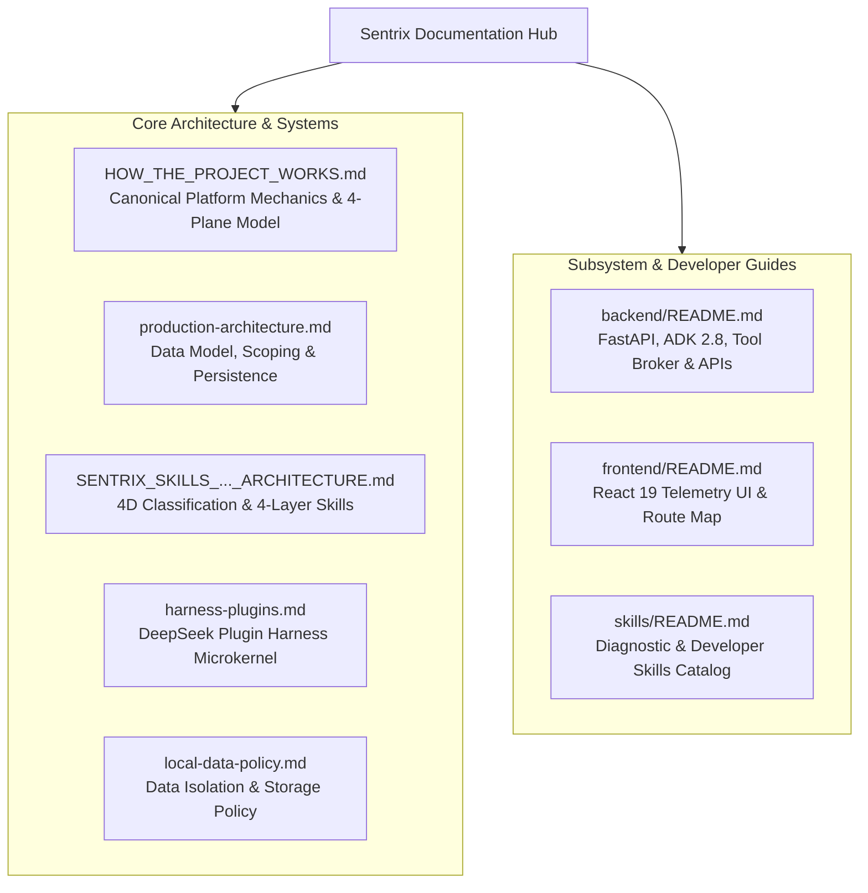

# Sentrix Documentation Hub

Welcome to the comprehensive technical documentation for **Sentrix**, the enterprise autonomous Site Reliability Engineering (SRE) and multi-tenant incident governance platform.

This directory is the source of truth for platform architecture and operating behavior. The root [README](../README.md) is the entry point for setup; component READMEs explain local development; documents here define cross-cutting contracts and governance.

---

## 📖 Architecture & Operations Specifications

Read in this order when onboarding:

1. **How the Platform Works** — the canonical logical architecture and incident lifecycle.
2. **Production Architecture & Data Model** — persistence, scoping, runtime, and deployment details.
3. **Skills & Request Classification** — capability composition and request policy.
4. **Harness Plugins Architecture** — runtime extension points and configuration inheritance.

| Document | Focus Area | Description |
|---|---|---|
| [**How the Platform Works**](./HOW_THE_PROJECT_WORKS.md) | Platform Mechanics | End-to-end incident lifecycle, 4-Plane architecture model, Live Triage Board mechanics, and Guarded Tool Broker dispatch sequence. |
| [**Production Architecture & Data Model**](./production-architecture.md) | Persistence & Topologies | Four-tier tenant hierarchy (`Org -> Team -> Project -> Environment`), async SQLAlchemy lifecycle, database DDL scripts, and deployment models. |
| [**Skills & Request Classification**](./SENTRIX_SKILLS_AND_REQUEST_CLASSIFICATION_ARCHITECTURE.md) | Intelligence Architecture | 4-Dimensional chat request classifier (Intent, Scope, Mode, Risk) and 4-Layer skill hierarchy (L0 System, L1 Platform, L2 Project, L3 User). |
| [**Harness Plugins Architecture**](./harness-plugins.md) | Agent Runtime Microkernel | "Everything is a Plugin" design, Context Budgeter, FinOps Tracker, Session Recorder, RCA Engine, and configuration inheritance. |
| [**Local Data & Hygiene Policy**](./local-data-policy.md) | Governance & Data Isolation | Rules governing local artifact storage, quarantine boundaries, and database seeding. |

---

## 🛠️ Subsystem Developer Guides

- **[Backend Architecture & Developer Manual](../backend/README.md)**:  
  Detailed guide to the FastAPI ASGI service, Google ADK 2.8 runtime, database models, connector registry, background ingestion scheduler, and REST/SSE API directory.

- **[Frontend Architecture & Design System](../frontend/README.md)**:  
  Guide to the React 19 + Vite 8 user interface, dark/light telemetry styling tokens, Live Triage Board, Investigation Stream, SVG DAG visualizer, and Action Approval Card components.

- **[Skills Catalog & Organization](../skills/README.md)**:  
  Clear distinction between developer assistance skills (`.agents/skills/`) and platform runtime diagnostic skills (`storage/skills/platform/`).

---

## 🚀 Key User Journeys

1. **On-Call SRE Engineer:** Follows the [Operational Runbook](./HOW_THE_PROJECT_WORKS.md#8-day-to-day-operational-runbook) on the Live Triage Board (`/p/:projectKey/board`), inspects live telemetry streams, evaluates topological RCA DAGs, and cryptographically authorizes staged remediations.
2. **Platform Administrator:** Uses the [Production Architecture Guide](./production-architecture.md) and Admin Console (`/admin/*`) to manage enterprise organizations, configure multi-cloud connector credentials, monitor system health, and review audit logs.
3. **Domain Developer / SRE Lead:** Leverages the [Harness Configuration Guide](./harness-plugins.md) and [Skills Specification](./SENTRIX_SKILLS_AND_REQUEST_CLASSIFICATION_ARCHITECTURE.md) to author project-scoped diagnostic runbooks, compose L2 skills, and map dynamic environment conduits.

---

*Sentrix Documentation Matrix — Engineering Autonomous Reliability with Mathematical Rigor.*
