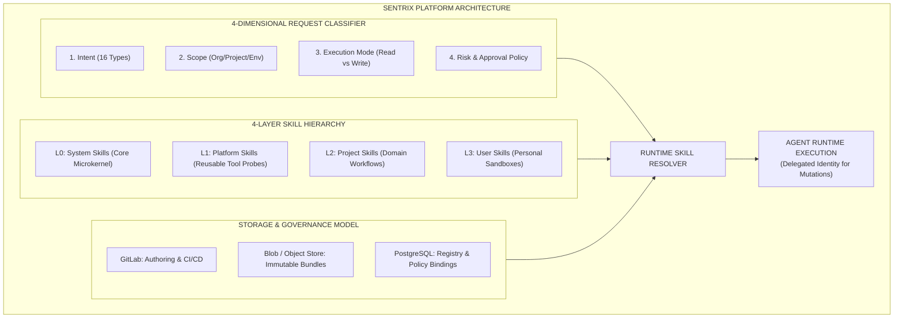
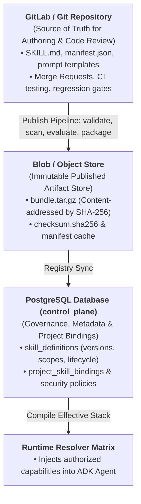
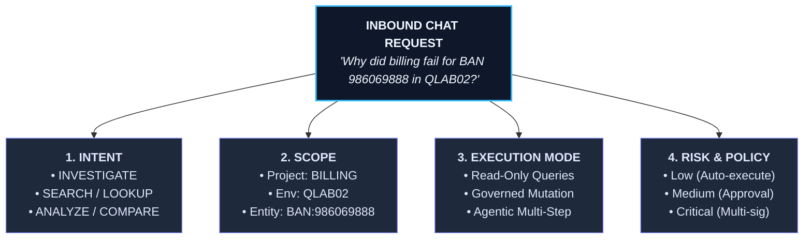
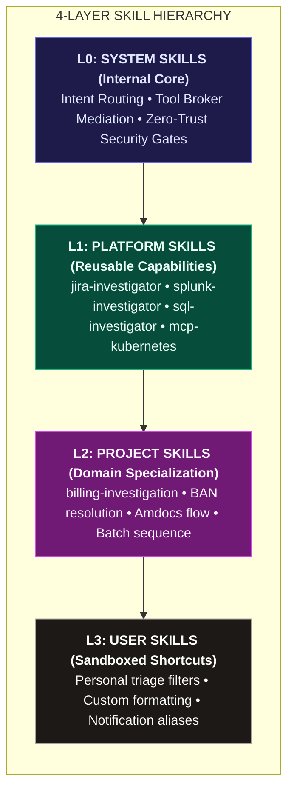

# Sentrix Autonomous SRE Platform
## Comprehensive Architecture Specification: Layered Skills, 4-Dimensional Request Classification, and Governed Execution Framework

---

### Executive Summary & Design Vision

Sentrix is an autonomous site reliability engineering (SRE) and telemetry investigation platform. Modern enterprise investigations are rarely isolated tool executions—they are complex, cross-domain workflows spanning issue trackers (Jira), log indexing engines (Splunk, Unix hosts), time-series APM (SignalFx), relational databases (Oracle, PostgreSQL), and orchestration systems (Kubernetes).

This specification establishes two foundational architectural pillars for Sentrix:
1. **4-Dimensional Chat Request Classification & Envelope**: Shifting away from naive tool-based classification ("Jira request", "Splunk request", "Database request") to a multidimensional classification system based on **Intent**, **Scope**, **Execution Mode (Read vs. Write)**, and **Risk & Approval Policy**.
2. **4-Layer Capability & Skill Hierarchy (L0–L3)**: Separating platform capabilities, domain knowledge, and personal customizations into cleanly scoped, versioned, and immutable skill packages with deterministic composition, capability declarations (rather than raw credentials), and zero-trust security governance.
3. **Enterprise Storage & Governance Model**: Differentiating between development activities (authoring via GitLab / `.agents/skills`), runtime artifact storage (immutable versioned packages in Blob/Object store), and platform registry metadata (PostgreSQL database).
4. **Platform Skill Management Console**: Replacing static/hardcoded skills on the admin page with a dynamic, enterprise-grade Admin Skills Management Console supporting full lifecycle control, versioning, capability declarations, and simulation.
5. **Brand Harmonization**: Systematically removing outdated PRISM references and establishing uniform **Sentrix Autonomous SRE** branding across frontend, backend, APIs, and agent prompts.

---



---

## 1. Skill Storage, Scoping, and Repository Organization

### 1.1 Development Skills vs. Platform Runtime Skills
In the current repository, a `skills/` directory sits at the root alongside `backend/` and `frontend/`. 
- **Developer Assistance Skills**: These are instructions and cheatsheets utilized during development by IDE agents (such as Google Antigravity / Gemini CLI). These belong exclusively in `.agents/skills/` (e.g., `.agents/skills/sentrix-platform-architecture/`) and must not be confused with platform runtime capabilities.
- **Platform Runtime Skills**: These are capabilities and workflows executed by the Sentrix Autonomous Agent when serving end-user investigations. These are modeled in the database (`control_plane.skill_definitions`), packaged as immutable bundles in object storage (`storage/skills/bundles/`), and authored in Git repositories (`backend/skills/platform/` or external GitLab repositories).

### 1.2 Three-Storage Model



| Layer | Responsibility | Storage Mechanism | Immutability |
| :--- | :--- | :--- | :--- |
| **Source** | Authoring, PR/MR reviews, CI test suites, version history | GitLab / Git Repository | Mutable via Git branches |
| **Artifact** | Packaged execution bundles (`bundle.tar.gz`, `manifest.json`, `checksum.sha256`) | Azure Blob Storage / MinIO / S3 (`storage/skills/bundles/`) | Strictly Immutable |
| **Registry** | Metadata, active versions, project bindings, authorization policies | PostgreSQL (`control_plane` schema) | Governed database records |

---

## 2. 4-Dimensional Chat Request Classification

Investigations cannot be reduced to single-tool commands. For example:
> *"Why did billing fail for BAN 986069888 in QLAB02?"*

This requires querying Jira for incident context, extracting the BAN and Order ID, querying Oracle billing tables (`BAN_ERROR`, `BILLING_DEPENDENCIES`), searching Unix batch logs for `BLDISC`, correlating Splunk error clusters, and identifying the root cause (e.g., missing discount code `DCC_R068`). This is **one unified Investigation Request**, not five disconnected tool calls.

Sentrix decomposes every inbound request into **four orthogonal dimensions**:



### 2.1 Dimension 1: Request Intent Taxonomy

Sentrix supports 16 top-level request intents plus continuation:

| Intent Type | Purpose | Example Inbound Prompt | Typical Behavior |
| :--- | :--- | :--- | :--- |
| **`ASK`** | Answer domain or architectural question | *"What does BLDISC do?"* | Retrieve knowledge base + explain |
| **`SEARCH`** | Find candidate entities across systems | *"Find Jira issues related to RS-176248"* | Broad search across Jira/Confluence |
| **`LOOKUP`** | Fetch known entity by unique identifier | *"Get details for STDP-4065"* | Deterministic direct fetch |
| **`INVESTIGATE`** | Multi-step root cause analysis | *"Why did billing fail for this BAN?"* | Autonomous multi-stage hypothesis & evidence collection |
| **`ANALYZE`** | Process & correlate retrieved telemetry | *"Analyze these Splunk error spikes"* | Statistical, anomaly, and pattern analysis |
| **`COMPARE`** | Contrast environments, runs, or entities | *"Compare QLAB02 vs QLAB03 failures"* | Parallel retrieval + differential synthesis |
| **`SUMMARIZE`** | Condense lengthy records or threads | *"Summarize this Jira thread and comments"* | Read-only extraction and concise synthesis |
| **`EXPLAIN`** | Interpret code, error stacks, or topologies | *"Explain this Java stack trace"* | Deep reasoning + contextual interpretation |
| **`GENERATE`** | Create content without external mutation | *"Generate SQL to check BAN_ERROR"* | Artifact creation (draft SQL, draft Jira comment) |
| **`PLAN`** | Design execution or migration procedure | *"How should we migrate this connector?"* | Step-by-step reasoning + proposed actions |
| **`EXECUTE`** | Perform an approved external operation | *"Run this approved read query"* | Direct governed capability execution |
| **`CHANGE`** | Mutate external state | *"Assign ticket RS-176248 to Amdocs Billing"* | Mutation execution path (approval-gated) |
| **`APPROVE`** | Affirm or reject pending action | *"Approve staged comment"* | Action approval resolution |
| **`ADMINISTER`** | Platform or project administration | *"Register Splunk connector for QLAB03"* | Privileged control-plane configuration |
| **`CREATE_WORKFLOW`** | Package repeated workflow into skill | *"Create a billing investigation workflow"* | Skill / workflow creation pipeline |
| **`CONVERSE`** | Casual or contextual dialogue | *"What do you recommend we do next?"* | Conversational reasoning |
| **`CONTINUE`** | Follow-up within existing investigation | *"Check QLAB03 also"* / *"Go deeper into logs"* | Preserves context, mutates scope/parameters |

### 2.2 Dimension 2: Scope Resolution
Every request is scoped across four coordinate axes:
- **Project**: Target workspace (e.g., `prj_billing`, `prj_core`).
- **Environment**: Runtime topology boundary (e.g., `QLAB02`, `QLAB03`, `PROD`).
- **Entity**: Extracted domain entities (e.g., BAN `986069888`, Order ID `25624850260`, Ticket `RS-176248`).
- **User / Session**: Initiating actor identity and RBAC role.

### 2.3 Dimension 3: Execution Mode & Read vs. Write Separation
Sentrix strictly bifurcates execution into two distinct security pipelines:

```
  A. READ-ONLY PIPELINE                      B. WRITE / MUTATION PIPELINE
  (Search, Query, Inspect, Correlate)         (Comment, Assign, Restart, DB Update)
               │                                           │
               ▼                                           ▼
      Access Policy Check                         Access Policy Check
               │                                           │
               ▼                                           ▼
  Execute using Platform Service Identity         Prepare Action & Preview Diff
               │                                           │
               ▼                                           ▼
     Return Telemetry / Evidence                    USER APPROVAL REQUIRED
                                                           │
                                                           ▼
                                                Execute using Delegated Identity
                                                           │
                                                           ▼
                                                Cryptographic Audit Log
```

- **Read-Only**: Safely executes automatically within project boundaries using platform service credentials. No approval is needed simply because multiple tools (Jira, DB, Splunk, Unix) were chained.
- **Write / Mutation**: Modifies external systems. Requires generating a structured preview, evaluating security policies, capturing explicit human approval, executing under the user's delegated identity, and recording an immutable audit entry.

### 2.4 Dimension 4: Risk Tier & Approval Policy

| Risk Tier | Mutation? | Reversible? | Examples | Policy Enforcement |
| :--- | :--- | :--- | :--- | :--- |
| **`LOW`** | No | N/A | Log search, DB SELECT, Jira read | Auto-executed |
| **`MEDIUM`** | Yes | Yes | Add Jira comment, update issue label | Explicit single-user approval |
| **`HIGH`** | Yes | Difficult | Restart pod, failover traffic, DB UPDATE | Project Admin approval + 2FA |
| **`CRITICAL`** | Yes | No | Schema drop, credential rotate, prod flush | Multi-signature dual approval |

### 2.5 The Sentrix Canonical Request Envelope

```json
{
  "request_id": "req_88f912c4",
  "conversation_id": "conv_39108a1b",
  "timestamp": "2026-09-04T15:30:00Z",
  "user": {
    "user_id": "usr_sre_01",
    "delegated_identity": "sre-analyst@company.com",
    "roles": ["SRE_LEAD", "PROJECT_MEMBER"]
  },
  "intent": {
    "type": "INVESTIGATE",
    "subtype": "ROOT_CAUSE",
    "confidence": 0.98
  },
  "scope": {
    "project_id": "prj_billing",
    "environment": "QLAB02"
  },
  "entities": [
    { "type": "account.id", "value": "986069888", "source": "user_prompt" },
    { "type": "order.id", "value": "25624850260", "source": "user_prompt" },
    { "type": "ticket.key", "value": "RS-176248", "source": "jira_ref" }
  ],
  "execution": {
    "mode": "agentic",
    "allow_reads": true,
    "allow_writes": false
  },
  "risk": {
    "tier": "LOW",
    "approval_required": false,
    "reversible": true
  },
  "context": {
    "continuation_of": null,
    "parent_request_id": null
  }
}
```

---

## 3. 4-Layer Capability & Skill Hierarchy (L0–L3)

Sentrix implements a clean **layered capability architecture**:



### 3.1 Layer Breakdown

1. **L0 — System Skills (Internal Core)**:
   - Built into Sentrix; immutable by users and project owners.
   - Responsibilities: Request classification, parameter resolution, tool broker routing, security policy enforcement, streaming event dispatch, memory compilation.
2. **L1 — Platform Skills (Reusable Enterprise Capabilities)**:
   - Centrally governed capabilities managed by Platform Administrators.
   - Examples: `jira-investigator`, `splunk-investigator`, `sql-investigator`, `signalfx-investigator`, `log-correlation`, `root-cause-analysis`.
   - **Crucial Rule**: Platform skills declare *capabilities* (`ticket.read`, `logs.search`, `database.query.read`), never project-specific details or credentials. They do not know what `QLAB02` or `BAN` means.
3. **L2 — Project Skills (Domain Specialization)**:
   - Composed on top of L1 platform skills by Project Admins.
   - Example: `billing-investigation` composes `jira-investigator`, `sql-investigator`, `splunk-investigator`, and `log-correlation`.
   - Adds domain knowledge: Maps `account.id` to `BAN`, specifies database tables (`BAN_ERROR`, `BILLING_DEPENDENCIES`), defines the job flow sequence (`BLDISC`, etc.), and specifies routing rules (e.g., Amdocs Billing).
4. **L3 — User Skills (Sandboxed Personal Customizations)**:
   - Individual user shortcuts and preferences (e.g., `my-billing-triage`, preferred summary formats, custom notification aliases).
   - Strictly restricted: **Zero privilege escalation**. A user cannot enable write access if the platform or project policy prohibits it.

### 3.2 Composition Over Inheritance
Sentrix avoids deep, brittle inheritance trees ($A \rightarrow B \rightarrow C \rightarrow D$). Instead, it uses **modular composition**:

```yaml
apiVersion: sentrix.ai/v1
kind: Skill
metadata:
  name: billing-investigation
  displayName: Billing Failure Autonomous Investigation
  version: 3.2.0
scope: project
ownership:
  owner: billing-sre-squad
description: >
  Autonomously investigates billing execution failures, queries account tables,
  inspects batch logs, and identifies root cause failures.
activation:
  intents:
    - INVESTIGATE
    - ANALYZE
  entities:
    - BAN
    - ORDER_ID
requires:
  capabilities:
    - ticket.read
    - database.query.read
    - logs.search
    - host.files.search
uses:
  skills:
    - platform:jira-investigator@3.1.0
    - platform:sql-investigator@2.0.0
    - platform:splunk-investigator@2.4.0
    - platform:log-correlation@1.8.0
```

### 3.3 Governance Rule: Permission Intersection
The effective runtime permissions of an investigation are always the strict mathematical **intersection** of all security layers:

$$\text{Effective Permissions} = \mathcal{P}_{\text{Platform}} \cap \mathcal{P}_{\text{Project}} \cap \mathcal{P}_{\text{User}} \cap \mathcal{P}_{\text{Connector}} \cap \mathcal{P}_{\text{Environment}} \cap \mathcal{P}_{\text{Skill}}$$

*A lower layer may tighten restrictions, but can never weaken or escalate privileges.*

---

## 4. Prompt Architecture vs. Technical Runtime Enforcement

A critical flaw in naive AI architectures is relying on LLM prompts for security (e.g., *"Please do not write to the database"*). In Sentrix, **prompts guide reasoning; code, schemas, and runtime policies enforce guarantees.**

### 4.1 Sentrix Prompt Assembly Stack

```
 ┌────────────────────────────────────────────────────────┐
 │ 1. SYSTEM DIRECTIVES (Sentrix Global Guardrails)       │
 ├────────────────────────────────────────────────────────┤
 │ 2. PROJECT CONTEXT (Domain rules, signal mappings)     │
 ├────────────────────────────────────────────────────────┤
 │ 3. ACTIVE SKILL INSTRUCTIONS (Composed reasoning plan) │
 ├────────────────────────────────────────────────────────┤
 │ 4. USER PREFERENCES (Formatting, verbosity, depth)     │
 ├────────────────────────────────────────────────────────┤
 │ 5. RUNTIME CONTEXT (Project, environment, user roles)  │
 ├────────────────────────────────────────────────────────┤
 │ 6. TOOL CONTRACT SCHEMAS (Strict JSON schemas)         │
 ├────────────────────────────────────────────────────────┤
 │ 7. USER REQUEST & CONVERSATION HISTORY                 │
 └────────────────────────────────────────────────────────┘
```

---

## 5. Extensibility: Dynamic Connector & Skill Extension via APIs and MCPs

Sentrix is engineered for zero-downtime extensibility. Adding a new telemetry source, operational system, or diagnostic skill does not require redeploying backend containers or recompiling core agent code.

```
 ┌────────────────────────────────────────────────────────────────────────┐
 │                       SENTRIX EXTENSIBILITY ENGINE                     │
 ├──────────────────────────────────┬─────────────────────────────────────┤
 │     DYNAMIC CONNECTOR EXTENSION  │        DYNAMIC SKILL EXTENSION      │
 │  • Model Context Protocol (MCP)  │  • Platform Skills via REST API     │
 │    (SSE / stdio / HTTP)          │  • Project Skills & Flow Customizer │
 │  • OpenAPI / REST Connectors     │  • User Skills & Custom Instructions│
 │  • Auto-Discovery of Tools       │  • Skill Bundle Import (tar.gz)     │
 │  • Live Connection Testing       │  • Capability-to-Connector Binding  │
 └──────────────────────────────────┴─────────────────────────────────────┘
```

### 5.1 Model Context Protocol (MCP) Integration
Sentrix natively acts as an enterprise **MCP Host & Governance Gateway**:
1. **Dynamic Tool & Resource Discovery**:
   - An administrator submits an MCP server endpoint (e.g., `sse://mcp-k8s.internal:8080` or `stdio://npx -y @modelcontextprotocol/server-postgres`) via `POST /admin/connectors/mcp/discover`.
   - Sentrix initiates the MCP handshake, invokes `tools/list` and `resources/list`, and dynamically ingests tool names, descriptions, and JSON schemas.
   - Each discovered tool is registered as a governed capability (e.g., `mcp.kubernetes.pod_list`, `mcp.postgres.query_read`).
2. **Runtime Capability Invocation**:
   - Read tools route automatically through the platform execution pipeline returning `NormalizedEvidence`.
   - Mutating tools (e.g., `mcp.kubernetes.restart_deployment`) generate an `ActionProposalPayload`, requiring human approval before the MCP JSON-RPC call is dispatched.
3. **Decoupled Architecture**:
   - Skills do not hardcode MCP transport details; they merely declare:
     ```yaml
     requires:
       capabilities:
         - mcp.kubernetes.pod_list
         - mcp.kubernetes.get_logs
     ```
   - The runtime `ToolBroker` and `ConnectorRegistry` resolve and proxy the invocation transparently.

### 5.2 Dynamic Connector Management via REST APIs
Sentrix exposes a full lifecycle API for enterprise connectors:
- `POST /admin/connectors`: Register a new connector instance (Jira, Splunk, Oracle, Datadog, REST, MCP) with environment-specific credentials and endpoints.
- `POST /admin/connectors/{id}/test`: Perform a live handshake and measure round-trip latency.
- `GET /admin/connectors/capabilities`: List all registered capabilities across all active connectors.
- `PUT /admin/connectors/{id}`: Update authentication keys, URL endpoints, or timeouts with zero downtime.

### 5.3 Dynamic Skill Extension via APIs and Project Flow Customization
1. **Platform Skill Publishing via API**:
   - CI/CD pipelines (e.g., GitLab CI) or platform developers can publish skills programmatically via `POST /admin/skills`:
     ```json
     {
       "skill_key": "kubernetes-pod-triage",
       "name": "Kubernetes Pod Failure Diagnostic",
       "version": "1.0.0",
       "scope": "PLATFORM",
       "required_capabilities": ["mcp.kubernetes.pod_list", "mcp.kubernetes.get_logs"],
       "intents": ["INVESTIGATE", "ANALYZE"],
       "instructions_markdown": "1. Check pod crash status. 2. Retrieve last terminated container logs...",
       "output_spec": { "required": ["failing_pod", "exit_code", "root_cause"] }
     }
     ```
2. **Project-Level Agent Flow Customization**:
   - Projects can bind platform skills and define custom flow behavior via `POST /projects/{project_id}/skills`:
     - **Custom Instructions**: Injects project-specific operational runbooks or squad routing rules.
     - **Workflow Sequences**: Defines step-by-step investigation pipelines (`extract_signals` $\rightarrow$ `query_account_tables` $\rightarrow$ `correlate_logs` $\rightarrow$ `propose_routing`).
     - **Parameter Overrides**: Pin specific tables, log directories, or search time windows.
3. **User-Level Custom Instructions**:
   - Individual users can configure personal shortcuts and instructions via `POST /user/skills`:
     - Personal formatting preferences (e.g., concise summaries vs. exhaustive log traces).
     - Personal investigation aliases and squad routing defaults.
     - Sandboxed execution guarantees: user skills cannot bypass project security policies or execute unapproved mutations.

---

## 6. Database Schema & Models

To support dynamic management, versioning, and scope filtering, the database schema in `control_plane` is expanded:

### 6.1 Enhanced `control_plane.skill_definitions`
```sql
ALTER TABLE control_plane.skill_definitions 
ADD COLUMN IF NOT EXISTS scope VARCHAR(32) DEFAULT 'PLATFORM' NOT NULL,
ADD COLUMN IF NOT EXISTS owner VARCHAR(128) DEFAULT 'Sentrix Platform' NOT NULL,
ADD COLUMN IF NOT EXISTS visibility VARCHAR(32) DEFAULT 'GLOBAL' NOT NULL,
ADD COLUMN IF NOT EXISTS source_type VARCHAR(32) DEFAULT 'GITLAB' NOT NULL,
ADD COLUMN IF NOT EXISTS repository_url VARCHAR(512),
ADD COLUMN IF NOT EXISTS commit_sha VARCHAR(64),
ADD COLUMN IF NOT EXISTS package_uri VARCHAR(512),
ADD COLUMN IF NOT EXISTS package_hash VARCHAR(64),
ADD COLUMN IF NOT EXISTS workflow_spec_json JSONB DEFAULT '{}'::jsonb NOT NULL,
ADD COLUMN IF NOT EXISTS policies_json JSONB DEFAULT '{"read_only": true, "risk_tier": "LOW"}'::jsonb NOT NULL,
ADD COLUMN IF NOT EXISTS parameters_json JSONB DEFAULT '[]'::jsonb NOT NULL,
ADD COLUMN IF NOT EXISTS invocations_count INTEGER DEFAULT 0 NOT NULL;
```

### 6.2 Enhanced `control_plane.project_skill_bindings`
```sql
ALTER TABLE control_plane.project_skill_bindings
ADD COLUMN IF NOT EXISTS custom_instructions TEXT,
ADD COLUMN IF NOT EXISTS parameter_overrides_json JSONB DEFAULT '{}'::jsonb NOT NULL,
ADD COLUMN IF NOT EXISTS approval_policy VARCHAR(64) DEFAULT 'PLATFORM_DEFAULT' NOT NULL;
```

---

## 7. Dynamic Admin Skills Management Console

The static/mocked `AdminSkillsCatalogPage.jsx` is transformed into an interactive enterprise catalog:
- **Scope Navigation**: `[All Skills]` | `[Platform Skills (L1)]` | `[Project Skills (L2)]` | `[User Skills (L3)]`.
- **Lifecycle Management**: View and transition states (`DRAFT` $\rightarrow$ `VALIDATING` $\rightarrow$ `EVALUATING` $\rightarrow$ `ACTIVE` $\rightarrow$ `DEPRECATED`).
- **Capability Inspector**: Live inspection of required vs. optional tool capabilities, accepted signals, and permission tiers (`READ_ONLY` vs. `GOVERNED_WRITE`).
- **Skill Authoring & Editing Drawer**: Complete modal/drawer for creating new platform skills, editing instruction markdown, defining input/output schemas, and testing execution.
- **RESTful Endpoints**:
  - `GET /admin/skills`: Paginated, filterable by scope, category, and lifecycle.
  - `POST /admin/skills`: Create new platform or project skill.
  - `PUT /admin/skills/{id}`: Update metadata, instructions, capabilities.
  - `POST /admin/skills/{id}/lifecycle`: Transition state (`ACTIVE`, `DEPRECATED`).
  - `POST /admin/skills/{id}/publish`: Package immutable bundle and compute SHA-256 hash.
  - `DELETE /admin/skills/{id}`: Soft-delete skill definition.

---

## 8. Sentrix Brand Unification

All references to the predecessor term "PRISM" are eliminated across:
- **Frontend**: Component names, titles, card styles, and layout elements unified to `Sentrix*`.
- **Backend**: API titles, route docstrings, log messages, seed scripts, and models updated to Sentrix Autonomous SRE Platform.
- **Agent Prompts**: Triage responses, agent identity strings, and mock telemetry rebranded to Sentrix.

---

## 9. Implementation Roadmap

1. **Phase 1**: Database migrations and enhanced SQLAlchemy ORM models (`scope`, `lifecycle_status`, `package_uri`, `policies_json`).
2. **Phase 2**: Dynamic Extensibility for Connectors (MCP discovery endpoint `POST /admin/connectors/mcp/discover`, dynamic connector register API) and Skills.
3. **Phase 3**: 4-Dimensional Request Classifier & Envelope implementation in `backend/agent/request_classifier.py` and integration into `triage_engine.py`.
4. **Phase 4**: Enhanced `SkillsEngine` supporting L0–L3 resolution, composition, and immutable bundle materialization.
5. **Phase 5**: Full REST API endpoints in `backend/api/routes.py` for Admin Skill CRUD and lifecycle control.
6. **Phase 6**: Frontend redesign of `AdminSkillsCatalogPage.jsx` with scope filtering, creation/editing drawer, and live backend integration.
7. **Phase 7**: Brand unification across frontend and backend from PRISM to Sentrix.
8. **Phase 8**: Verification via end-to-end tests and automated smoke tests.
