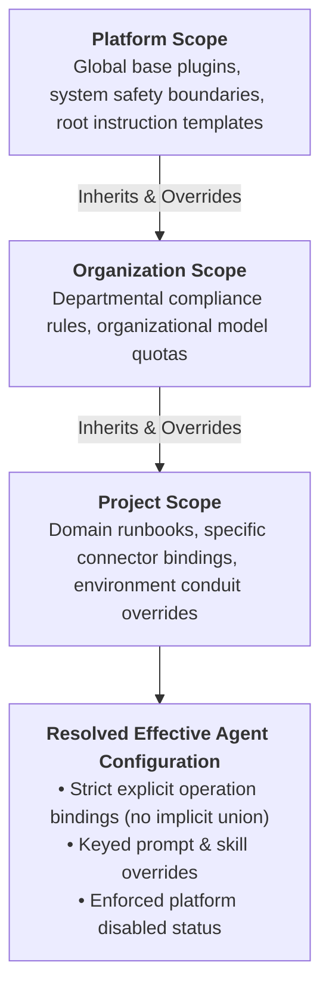
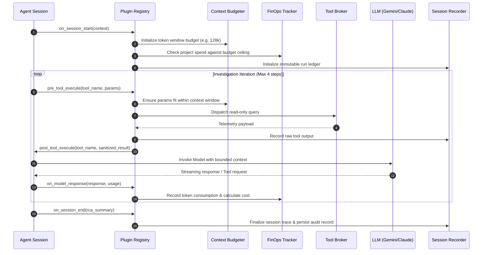

# DeepSeek Harness Plugin Architecture & Scoped Agent Composition

Sentrix incorporates a microkernel agent harness following an **"Everything is a Plugin"** design. Every runtime capability—from token budgeting to telemetry recording and root cause synthesis—is encapsulated as an isolated lifecycle plugin.

---

## 1. Harness Plugin Architecture

```mermaid
graph TB
    subgraph HarnessKernel["Sentrix Agent Harness Microkernel"]
        direction TB
        REG["HarnessPluginRegistry<br/>(Discovery, Initialization & Priority Pipeline)"]

        subgraph BuiltinPlugins["Built-in Core Plugins (Ordered Lifecycle Chain)"]
            BUDGET["ContextBudgeterPlugin<br/>(Tracks token footprints, truncates large payloads)"]
            FINOPS["FinOpsTrackerPlugin<br/>(Monitors inference costs, enforces project quotas)"]
            RECORD["SessionRecorderPlugin<br/>(Captures reproducible event & tool traces)"]
            RCA["RCAEnginePlugin<br/>(Constructs topological fault causality DAG)"]
        end

        REG --> BUDGET
        REG --> FINOPS
        REG --> RECORD
        REG --> RCA
    end

    subgraph ADKRuntime["Google ADK 2.8 Execution Engine"]
        AGENT["Project LlmAgent Instance"]
    end

    HarnessKernel <-->|Lifecycle Hooks (pre/post/stream)| AGENT
```

---

## 2. Configuration Inheritance Hierarchy

Harness configurations, instructions, and capability bindings inherit predictably from Platform down to Project:



### Inheritance Rules
1. **Explicit Binding Replacement:** A more specific plugin binding replaces the entire inherited binding. Operation permissions are never unioned implicitly.
2. **Keyed Prompt Overrides:** Instructions inherit by key. Supplying a `null` prompt entry explicitly removes an inherited prompt.
3. **Platform Override Supremacy:** If a plugin is disabled at the Platform scope, it can never be re-enabled at Organization or Project scopes.

---

## 3. Plugin Lifecycle Hook Pipeline

During an active investigation run, the harness invokes registered plugins at precise execution milestones:



---

## 4. Admin Management & Configuration APIs

Harness configurations can be inspected and updated through the Enterprise Admin Console (**Admin → Harness Configuration**) or directly via REST APIs:

| Endpoint | Method | Purpose |
|---|---|---|
| `/api/admin/harness-configuration/plugins` | `GET`, `POST` | List and register read-only connector plugin definitions. |
| `/api/admin/harness-configuration/scopes/{scope}/{scope_id}` | `GET`, `PUT` | Read or update configuration for a specific scope (`platform`, `organization`, `project`). |
| `/api/admin/harness-configuration/projects/{project_id}/resolved` | `GET` | Retrieve effective compiled plugin catalog and instructions for a project. |
| `/api/admin/harness-configuration/projects/{project_id}/execute` | `POST` | Execute a test investigation run using the resolved harness agent with SSE streaming. |

---

## 5. Security Invariants & Execution Boundaries

- **Read-Only Enforced:** The harness only exposes diagnostic read operations. All state-mutating operations trigger cryptographic action proposals requiring human SRE authorization.
- **Per-Call Adapters:** Credential-bearing adapters are instantiated per execution call rather than maintained in a global cache, preventing cross-tenant credential leakage.
- **Dynamic Policy Re-check:** On every tool invocation, the harness re-verifies the live configuration. Disabling a plugin immediately halts ongoing tool dispatches even for an in-flight agent session.

---

*Sentrix Harness Engine — Extensible, Governed, and Observable Agent Runtime.*
