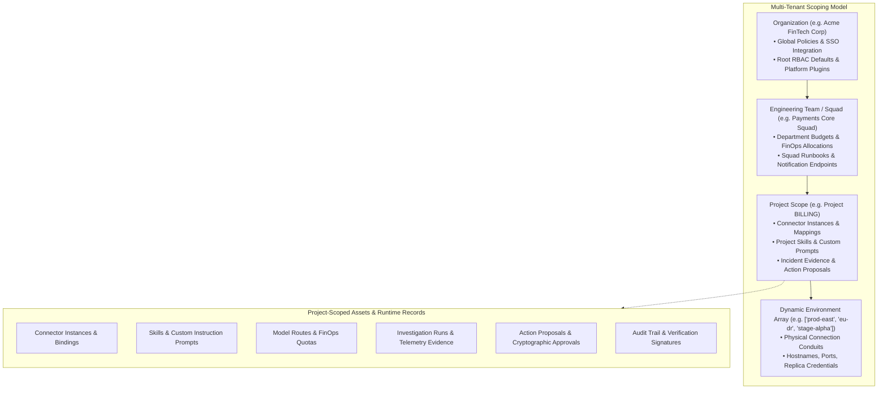
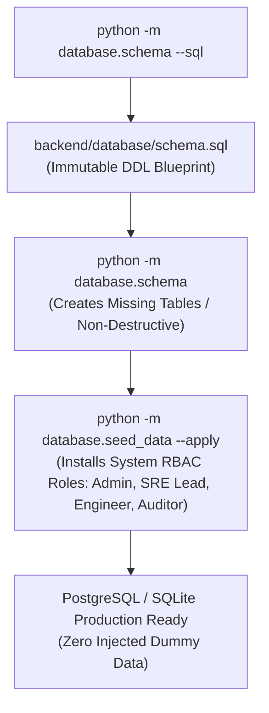
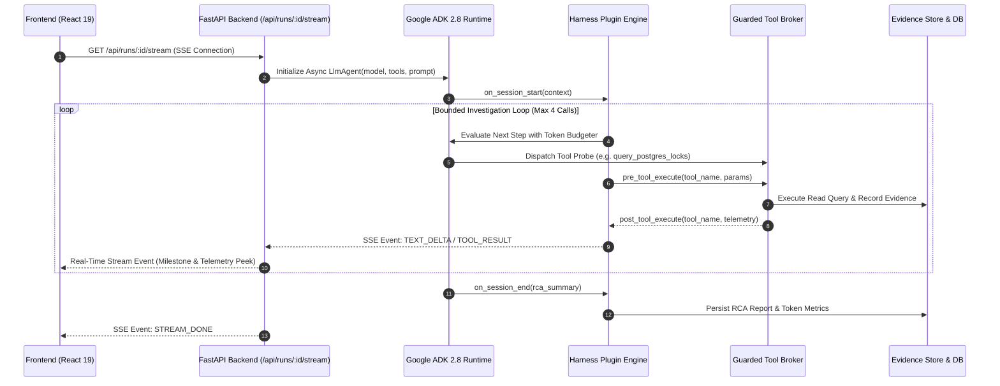
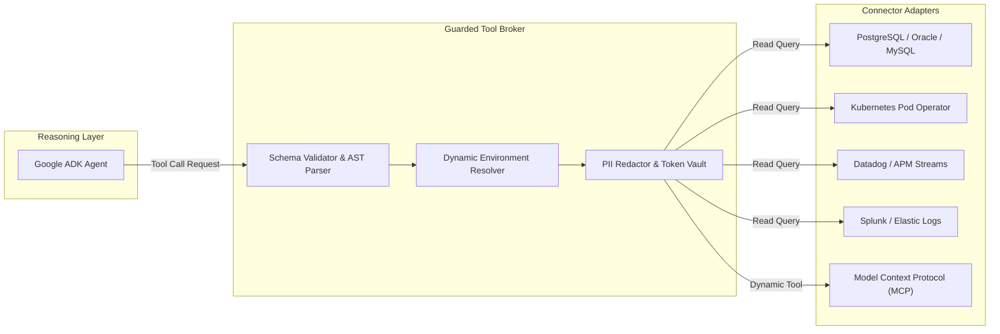
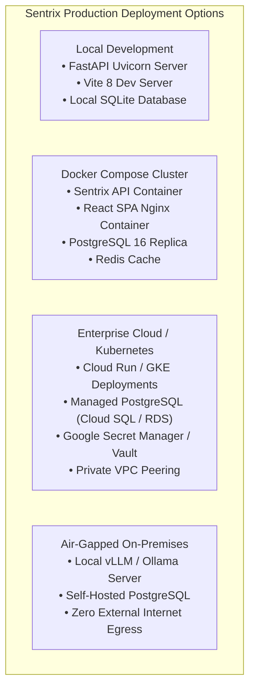

# Sentrix Production Architecture & Operational Specification

## Executive Overview
Sentrix is an enterprise-grade autonomous Site Reliability Engineering (SRE) platform engineered for zero-trust operational environments. It decouples high-reasoning diagnostic intelligence from mutating infrastructure execution, ensuring all modifying commands require human authorization via cryptographic proposals.

---

## 1. Multi-Tenant Scoping & Data Model

Sentrix organizes all tenancy, configurations, permissions, and runtime records across **four strictly enforced hierarchical scopes**:



### Scoping Invariants
1. **Strict Tenant Isolation:** No project may execute diagnostic queries or access evidence belonging to another project. Database queries are hard-scoped to `project_id`.
2. **Dynamic Environments:** Environments are not hardcoded (e.g. `dev`/`stage`/`prod`). Projects configure dynamic environments matching their physical topology (e.g. `us-east-prod`, `eu-west-dr`, `pci-vault`).
3. **Empty Database Validity:** The administration console and project dashboards treat an empty database as a valid, first-class state. No demo tenants are automatically inserted into production databases.

---

## 2. Database Lifecycle & Schema Management

Sentrix supports both **SQLite** (for local development and zero-dependency staging) and **PostgreSQL** (for enterprise production clusters) via **async SQLAlchemy 2.0**.



### Database Management Commands
```bash
# Export the complete database DDL schema
python -m database.schema --sql > database/schema.sql

# Create missing tables non-destructively (never drops tables or data)
python -m database.schema

# Seed explicit system RBAC role definitions
python -m database.seed_data --apply
```

### Key Database Schemas (`control_plane`)
- `control_plane.organizations`: Global enterprise tenant entities.
- `control_plane.teams`: Squad groupings and FinOps attribution units.
- `control_plane.projects`: Core operational boundaries owning connectors, runs, and policies.
- `control_plane.environments`: Project-specific environment definitions.
- `control_plane.connector_instances`: Registered enterprise connections (PostgreSQL, Datadog, Splunk, K8s).
- `control_plane.project_tool_env_mappings`: Dynamic conduit resolver linking project environments to connectors.
- `control_plane.runs`: Immutable investigation sessions with status, model snapshots, and token metrics.
- `control_plane.action_proposals`: Cryptographic remediation proposals awaiting domain engineer sign-off.
- `control_plane.audit_logs`: Append-only, tamper-resistant operational ledger.

---

## 3. Google ADK 2.8 Agent Runtime & Execution Lifecycle

The agent runtime is powered by **Google ADK 2.8** paired with the **DeepSeek Harness** microkernel:



### Execution Guardrails
- **Bounded Call Budget:** ADK agents execute with a hard cap of 4 iterative tool calls per investigation phase to eliminate infinite reasoning loops.
- **Strict Execution Timeouts:** Each diagnostic probe has an enforceable socket timeout (default 5,000ms).
- **Untrusted Evidence Isolation:** Raw external data (logs, SQL outputs, pod descriptors) is classified as untrusted input. The system never executes code embedded inside telemetry.
- **Typed Output Schemas:** Every agent milestone outputs strict Pydantic/JSON schemas validating root cause, severity, affected entities, and staged diffs.

---

## 4. Guarded Tool Broker & Connector Topology

Connectors isolate network communication protocols from the agent reasoning layer:



### Connector Invariants
- **No Mock Fallbacks in Production:** Connectors never silently fall back to synthetic local data when an endpoint is unreachable; they explicitly return `UNAVAILABLE` or raise connection errors.
- **AST SQL Inspection:** All relational database probes are parsed with `sqlglot`. Queries containing `INSERT`, `UPDATE`, `DELETE`, `DROP`, or `ALTER` are immediately rejected with security violations.
- **Dynamic MCP Discovery:** Sentrix dynamically queries MCP servers over standard stdio or SSE transports, converting registered MCP tools into ADK-compatible tool definitions.

---

## 5. Deployment Topologies



### Environment Variables Matrix
| Variable | Required | Description | Default |
|---|---|---|---|
| `DATABASE_URL` | Yes | SQLAlchemy async connection string | `sqlite+aiosqlite:///./sentrix.db` |
| `ADK_MODEL` | No | Default model route | `gemini-2.5-pro` |
| `GEMINI_API_KEY` | Conditional | Google Gemini API key for ADK | Set in vault |
| `ANTHROPIC_API_KEY` | Conditional | Claude 3.5 Sonnet API key | Set in vault |
| `OPENAI_API_KEY` | Conditional | OpenAI API key | Set in vault |
| `DEEPSEEK_API_KEY` | Conditional | DeepSeek R1/V3 API key | Set in vault |
| `PORT` | No | FastAPI listening port | `8000` |
| `CORS_ORIGINS` | No | Allowed frontend origins | `http://localhost:5173` |

---

*Sentrix Architectural Blueprint — Autonomous SRE with Verifiable Governance.*
