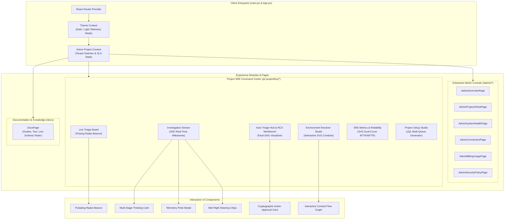

# Sentrix Frontend Application | Autonomous SRE Mission Control

[](https://vitejs.dev/)
[](https://reactrouter.com/)
[](https://lucide.dev/)
[](./src/index.css)

The **Sentrix Frontend** is a high-performance mission control application engineered with **React 19**, **Vite 8**, and a bespoke telemetry design system. It delivers real-time incident monitoring, interactive root cause exploration, Server-Sent Events (SSE) investigation streaming, dynamic environment conduit routing, and zero-trust cryptographic action approval workflows.

---

## 🏗️ Frontend Component & State Architecture



---

## 🎨 Design System & Telemetry Tokens

Sentrix features a custom-engineered **telemetry design system** specifically optimized for high-density observability dashboards:

### Key Design Tokens (`src/index.css`)
```css
:root {
  /* Brand Gradients */
  --prism-pink: #ec4899;
  --prism-cyan: #06b6d4;
  --prism-violet: #8b5cf6;
  --prism-amber: #f59e0b;
  --prism-emerald: #10b981;
  --prism-gradient: linear-gradient(135deg, #ec4899 0%, #8b5cf6 50%, #06b6d4 100%);
  
  /* Telemetry Dark Theme (Default) */
  --bg-primary: #090d16;
  --bg-elevated: #0f172a;
  --bg-card: rgba(15, 23, 42, 0.75);
  --border-subtle: rgba(255, 255, 255, 0.08);
  --border-focus: rgba(236, 72, 153, 0.5);
  --ink-primary: #f8fafc;
  --ink-secondary: #94a3b8;
  --ink-tertiary: #64748b;
}

[data-theme="light"] {
  /* High-Contrast Light Theme */
  --bg-primary: #f8fafc;
  --bg-elevated: #ffffff;
  --bg-card: rgba(255, 255, 255, 0.9);
  --border-subtle: rgba(0, 0, 0, 0.08);
  --ink-primary: #0f172a;
  --ink-secondary: #475569;
  --ink-tertiary: #94a3b8;
}
```

### Visual Features
- **Pulsating Radar Beacon:** Indicates active live polling and websocket/SSE connection status on the Live Triage Board.
- **Glassmorphic Elevations:** Semi-transparent cards with backdrop blur (`backdrop-filter: blur(12px)`) providing sleek layering.
- **Animated Progress Shimmer:** Real-time visual feedback while the ADK agent reasons through the 4 diagnostic milestones.

---

## 🧭 Application Route Directory

### Project SRE Workspaces (`/p/:projectKey/*`)
| Route | Component | Key Features |
|---|---|---|
| `/p/:projectKey/board` | `Live Triage Board` | **#1 Priority**: Real-time 4-column Kanban board, live radar beacon, SLA gauges, squad filters. |
| `/p/:projectKey/triage` | `Auto-Triage Hub` | Dual Jira/ServiceNow ingestion toggle, RCA drawer, SVG service flow visualizer, GitLab diff viewer. |
| `/p/:projectKey/investigations` | `ProjectAgentsPage` | Live SSE investigation stream, multi-stage progress card, telemetry peeks, mid-flight steering chips. |
| `/p/:projectKey/overview` | `ProjectOverviewPage` | Project command center with SLA compliance, MTTA/MTTR cards, and active incident trends. |
| `/p/:projectKey/metrics` | `ProjectMetricsPage` | Dual-curve SVG area charts (MTTA vs. MTTR), SLO error budget gauges, squad velocity histograms. |
| `/p/:projectKey/environments` | `ProjectToolsPage` | Dynamic environment-to-tool conduit resolver, 1-click latency ping tester. |
| `/p/:projectKey/setup` | `ProjectSetupStudioPage`| Multi-queue JQL generator, datasource setup forum, dynamic environment creator. |
| `/p/:projectKey/reports` | `ProjectReportsPage` | 4-cycle historical improvement curves, triage stats, executive email dispatch. |
| `/p/:projectKey/feedback` | `ProjectFeedbackPage` | Domain engineer validation, accuracy ratings, and reinforcement feedback for models. |

### Enterprise Administration Console (`/admin/*`)
| Route | Component | Key Features |
|---|---|---|
| `/admin/overview` | `AdminOverviewPage` | System health overview, multi-project distribution, active connector status. |
| `/admin/projects` | `AdminProjectsFleetPage`| Lifecycle fleet manager, tier assignments, and environment provisioning. |
| `/admin/organizations` | `AdminOrganizationsPage`| Enterprise tenant management, department hierarchy, and billing quota inheritance. |
| `/admin/connectors` | `AdminConnectorsPage` | Enterprise connector inventory (Postgres, Oracle, Datadog, Splunk, K8s, Jira). |
| `/admin/system-health` | `AdminSystemHealthPage` | Real-time CPU/memory gauges, socket connection counts, connector ping times. |
| `/admin/billing` | `AdminBillingUsagePage`| FinOps cost breakdown, token attribution by project, and model spend rate limits. |
| `/admin/security-policy`| `AdminSecurityPolicyPage`| Immutable audit log viewer, PII redaction settings, and RBAC matrix. |
| `/docs` | `DocsPage` | In-app operational tour, interactive schema validator, prompt recipes. |

---

## ⚡ Quick Start: Frontend Developer Initiation

### 1. Prerequisites
- Node.js `v18.0.0` or higher (`v20+` recommended)
- npm or yarn

### 2. Installation
```bash
cd frontend

# Install all npm dependencies
npm install
```

### 3. Start Development Server
```bash
npm run dev
```
The Vite development server will launch at: **`http://localhost:5173`** with hot module replacement (HMR).

### 4. Build for Production
```bash
# Run oxlint quality checks
npm run lint

# Build optimized production bundle
npm run build

# Preview production build locally
npm run preview
```

---

## 🔌 API Proxy & Backend Integration

In development, Vite proxies requests from `/api` to the backend server running at `http://localhost:8000`:
- **REST Endpoints:** Standard JSON API interactions (`fetch` with async/await).
- **Live Telemetry Stream:** SSE client using `EventSource` listening on `/api/runs/{run_id}/stream`.
- **Zero-Trust Signatures:** Approving mutating actions sends cryptographically signed payloads back to the backend.

---

*Sentrix Mission Control — Fast, Responsive, and Visually Stunning Telemetry UI.*
