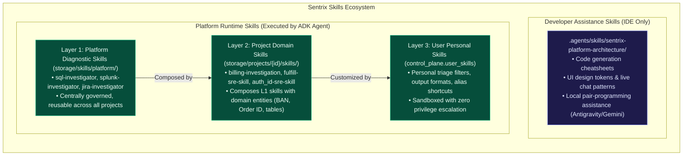

# Sentrix Skills Architecture & Catalog Organization

This document clarifies the structural taxonomy and storage boundaries between **Developer Assistance Skills** and **Platform Runtime Diagnostic Skills**.

---

## 1. Developer Assistance Skills
- **Location**: [`.agents/skills/sentrix-platform-architecture/`](../.agents/skills/sentrix-platform-architecture/)
- **Purpose**: Cheatsheets, UI specifications, and architectural rules used during local development by AI pair-programming agents (such as Google Antigravity or Gemini CLI).
- **Scope**: Local IDE development only; never executed in production by the autonomous SRE agent.

---

## 2. Platform Runtime Skills (Layer 1)
- **Location**: [`storage/skills/platform/`](../storage/skills/platform/) & PostgreSQL `control_plane.skill_definitions`
- **Catalog**:
  - `jira-investigator`: Query Jira Cloud issue history, status changes, and incident threads.
  - `splunk-investigator`: Query Splunk clusters for error frequency and log anomalies.
  - `sql-investigator`: Read-only AST-guarded relational database diagnostics.
  - `mcp-kubernetes`: Model Context Protocol tool probe for cluster pods and logs.
  - `log-correlation`: Temporal clustering and cross-service error correlation.
  - `root-cause-analysis`: Synthesis of diagnostic findings into a topological Fault DAG.
- **Principle**: Platform skills declare abstract capabilities (e.g. `database.query.read`, `logs.search`), never credentials or hardcoded project schemas.

---

## 3. Project Skills (Layer 2)
- **Location**: [`storage/projects/{project_id}/skills/`](../storage/projects/) & PostgreSQL `control_plane.project_skill_bindings`
- **Purpose**: Domain-specific investigation workflows (e.g. `billing-investigation`) that compose multiple Platform Skills and bind project domain entities (BAN, Order ID), table names (`BAN_ERROR`, `BILLING_DEPENDENCIES`), and batch job sequences (`BLDISC`).
- **Customization**: Squad leads configure runbooks, parameter overrides, and routing rules via the Sentrix UI or REST APIs.

---

## 4. User Skills (Layer 3)
- **Location**: PostgreSQL `control_plane.user_skills`
- **Purpose**: Personal shortcuts, formatting preferences, and custom triage instructions authored by individual engineers.
- **Security**: Strictly sandboxed with zero privilege escalation; cannot bypass project policies or perform unauthorized mutations.

---

> For the comprehensive architectural specification, review [**`docs/SENTRIX_SKILLS_AND_REQUEST_CLASSIFICATION_ARCHITECTURE.md`**](../docs/SENTRIX_SKILLS_AND_REQUEST_CLASSIFICATION_ARCHITECTURE.md).
